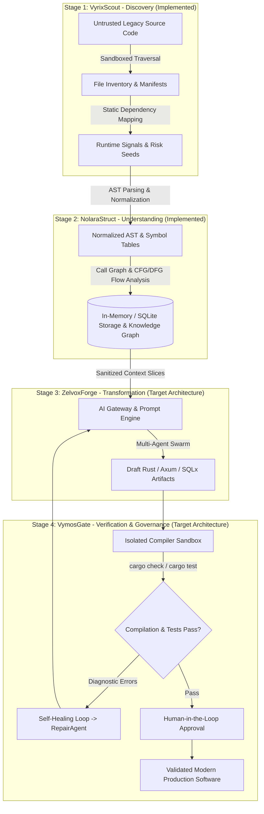
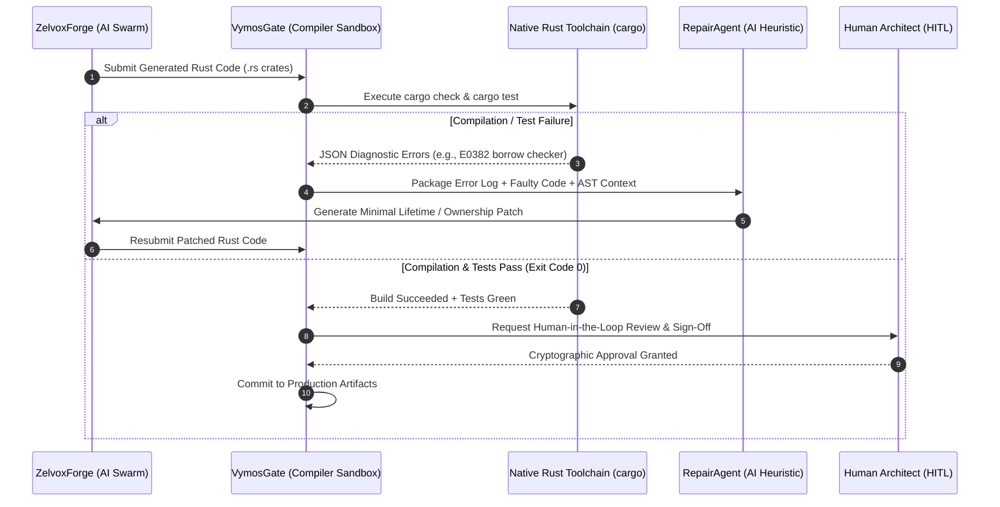
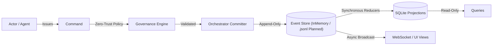
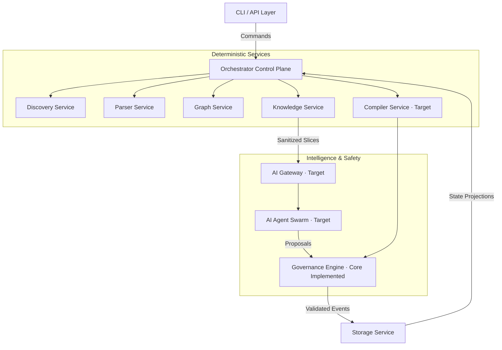
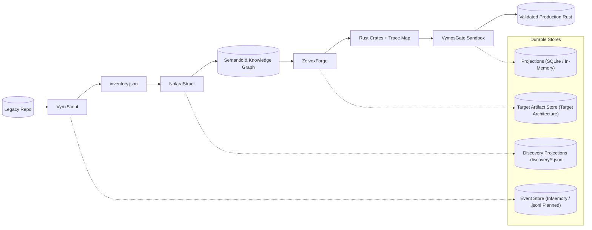
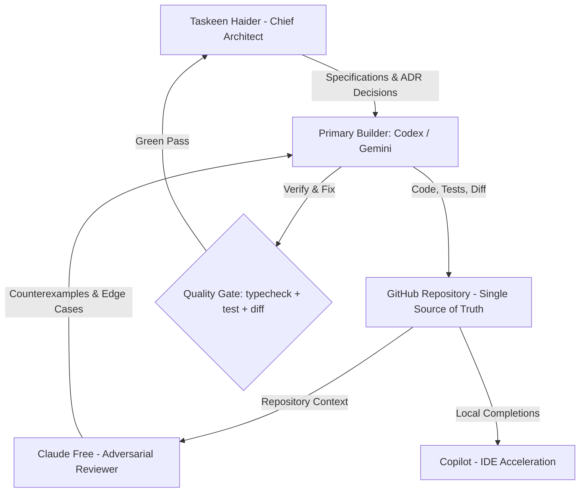

<div align="center">
  <picture>
    
  </picture>

  <h1>LegacyExodus</h1>
  <p><strong>Knowledge-First Software Modernization & Repository Intelligence Platform</strong></p>

  <p>
    <a href="https://github.com/LegacyExodus/LegacyExodus/blob/main/docs/community/CODE_OF_CONDUCT.md"></a>
    <a href="https://github.com/LegacyExodus/LegacyExodus/blob/main/docs/development/contribution-guide.md"></a>
    <a href="https://github.com/LegacyExodus/LegacyExodus/blob/main/docs/architecture/security-architecture.md"></a>
    <a href="https://github.com/LegacyExodus/LegacyExodus/blob/main/LICENSE"></a>
  </p>
  <p>
    =1.3.0-f9f8f6?style=for-the-badge&logo=bun" alt="Bun">
    
    
    
    
  </p>

  <p>
    <em>A knowledge-first engineering platform that systematically maps, documents, and prepares complex legacy software systems for evidence-driven modernization into memory-safe architectures.</em>
  </p>

  <p>
    <a href="#1-executive-vision">Vision</a> ·
    <a href="#2-the-legacy-crisis--the-pipeline-architecture">Pipeline</a> ·
    <a href="#8-cli-terminal-foundation--command-discovery">CLI</a> ·
    <a href="#9-non-negotiable-security-architecture--compliance-matrix">Security</a> ·
    <a href="#17-verified-evidence--empirical-validation-baseline">Evidence</a> ·
    <a href="#20-authoritative-documentation-ecosystem">Documentation</a>
  </p>
</div>

---

<table>
  <tr>
    <td align="center"><b>Development Milestone</b><br><code>Phase 3A / Hardened</code></td>
    <td align="center"><b>Implemented Pipeline</b><br><code>Stage 1 + Stage 2</code></td>
    <td align="center"><b>Future Pipeline</b><br><code>Stage 3 + Stage 4</code></td>
    <td align="center"><b>Migration Verdict</b><br><code>NOT YET ESTABLISHED</code></td>
  </tr>
</table>

> [!IMPORTANT]
> **Phase 3A is the current development milestone of the implemented repository-intelligence core.** It does **not** mean Pipeline Stage 3 (`ZelvoxForge`) is implemented. The currently implemented modernization pipeline covers **Stage 1 (`VyrixScout`)** and **Stage 2 (`NolaraStruct`)**; **Stage 3 (`ZelvoxForge`)** and **Stage 4 (`VymosGate`)** remain target architecture.


> **Current Implementation Reality (September 2026):**
> * **Implemented & Verified:** Deterministic JavaScript/TypeScript multi-stage repository intelligence pipeline running natively on Bun (Discovery, Babel AST Parsing & Normalization, Scope & Symbol Extraction with `var` hoisting, Destructuring pattern extraction, Default parameter filtering, CommonJS exports & prototype methods, Module resolution & Dependency graphs, Semantic Call graphs with constructor instantiation resolution, Do-While & Basic-Block CFG, Def-Use DFG with interprocedural taint flow, Streaming JSON serialization with 64KB backpressure, Deep-frozen In-Memory and SQLite indexed storage providers with snapshot reuse and artifact restoration, Three-Universe fidelity validator, 10-point governance self-audit, and 3-run bit-for-bit determinism across Tier 1, 2, and 3 targets — verified by 1,001 tests across 113 files).
> * **Security & Lifecycle Hardening:** Direct Git subprocess execution (`shell: false`), discovery manifest lexical and physical boundary containment verification, `.discovery` root and `manifest.json` symlink rejection, direct consumption of in-memory validated artifact bytes eliminating TOCTOU risk, recursive immutability on SQLite deserialization, loop fall-through correction, awaitable single-flight runtime shutdown barrier with primary error preservation, SQLite storage driver auto-inference and path validation, terminal event reduction lifecycle handling with stale metadata cleanup, atomic durable event sequence reservation, Windows drive-letter path canonicalization, lexical shadowing precision, and demand-driven finally CFG instantiation.
> * **CLI Foundation:** Comprehensive terminal interface with 3 themes (`classic`, `aurora`, `mono`), discovery options (`--refresh`, `--storage-driver`, `--storage-path`), dynamic test explorer with 12 subsystem domains (`test [domain]`, `--list`, `-v, --verbose`, `--bail`), multi-gate repository verification (`verify`), width-safe rendering (F-024), and pure machine-readable JSON output (`--json`).
> * **Target Architecture (Future Vision):** Unified IR/SSA intermediate representation, AI Gateway proxying, ZelvoxForge multi-agent code generation swarms, VymosGate isolated compiler sandboxes, and Rust/Axum/SQLx synthesis are planned target architecture and are **not present in the current core implementation**.
> * **Migration Safety Verdict:** Sample-based validation across 25 representative files per framework currently reports **99.4% recall for Express v4.21.2** and **100.0% recall for Fastify v5.3.3**. This is strong scoped evidence, but whole-repository migration safety remains strictly classified as `MIGRATION_SAFETY_NOT_YET_ESTABLISHED`.

### Current Capability Snapshot

| Capability | Current State | Evidence / Boundary |
|---|:---:|---|
| Repository discovery & manifesting | **Implemented** | Boundary containment, symlink rejection, deterministic discovery projections |
| JS/TS AST normalization & symbols | **Implemented** | Babel-based normalized ASTs, scope/symbol extraction, hoisting and destructuring handling |
| Dependency, call, CFG & DFG analysis | **Implemented** | Semantic call graphs, basic-block CFG, def-use DFG, interprocedural taint flow |
| Storage & deterministic replay | **Implemented** | In-memory + SQLite providers, snapshot reuse, artifact restoration, 3-run determinism |
| Governance & fidelity validation | **Core implemented** | Three-Universe model, 10/10 governance audit, migration verdict remains fail-closed |
| AI-guided Rust generation | **Target architecture** | `ZelvoxForge` is intentionally not represented as implemented |
| Sandboxed compile / repair loop | **Target architecture** | `VymosGate`, native Rust compile gates, HITL approval remain planned |

> [!TIP]
> The strongest current product story is **deterministic repository intelligence with measured fidelity**, not autonomous migration. The transformation and verification stages are deliberately separated as future architecture until they can meet the same evidence standard as the implemented core.


## 1. Executive Vision

Software modernization must be driven by rigorous deterministic understanding, not by blind, probabilistic code generation.

LegacyExodus is not a simple Large Language Model (LLM) wrapper, nor is it a basic AST transpiler. Its implemented core is a **strictly typed, CQRS-based repository-intelligence pipeline** that ingests undocumented codebases, extracts architectural knowledge, reconstructs program relationships, and produces deterministic evidence for modernization decisions. Its target architecture extends that evidence into human-governed migrations to memory-safe languages such as Rust.

> **Principal Insight: The Epistemological Imperative** <br>
> *Understand deterministically first. Transform probabilistically second. Verify empirically always.* <br>
> Naive AI tools attempt to modernize software by predicting tokens. LegacyExodus modernizes software by reconstructing the mathematical and topological reality of the system *before* a single line of target code is generated. By treating migration as a continuous, verifiable engineering pipeline rather than a prompt-engineering trick, LegacyExodus aims to preserve business logic, reduce modernization risk, and make developer trust evidence-based.

---

## 2. The Legacy Crisis & The Pipeline Architecture

Millions of mission-critical enterprise applications run on fragile, tightly coupled technology stacks. When attempting to modernize these systems, organizations increasingly turn to naive AI generation—feeding raw legacy files into an LLM and asking for a Rust/Go translation.

This approach fatally ignores the realities of enterprise software. It results in **topological hallucinations**, missed dependency graphs, and complete architectural failure because LLMs lack the global deterministic context of the application state. LegacyExodus completely decouples *comprehension* from *generation* via four heavily isolated architectural stages.

### The Pipeline Architecture Flow



---

## 3. The Four-Stage Modernization Pipeline

LegacyExodus executes its migration via four distinct, strictly governed architectural stages.

```text
CURRENT IMPLEMENTATION                                             TARGET ARCHITECTURE

[✓] VyrixScout  ─────►  [✓] NolaraStruct  ─────►  [ ] ZelvoxForge  ─────►  [ ] VymosGate
    Discovery               Understanding              Transformation            Verification

          Stage 1                 Stage 2                    Stage 3                   Stage 4
```

> [!NOTE]
> **Current milestone:** Phase 3A / Hardened. **Current pipeline coverage:** Stages 1–2. The stage numbering and development-phase numbering are separate systems and should not be interpreted as equivalent.

<table>
  <thead>
    <tr>
      <th align="left" width="15%">Pipeline Stage</th>
      <th align="left" width="15%">Codename</th>
      <th align="left" width="50%">Primary Responsibility</th>
      <th align="left" width="20%">Status</th>
    </tr>
  </thead>
  <tbody>
    <tr>
      <td align="left"><b>Stage 1</b></td>
      <td align="left"><code>VyrixScout</code></td>
      <td align="left"><b>Legacy Intelligence Discovery.</b> Maps physical boundaries, detects languages, maps static dependencies, and surfaces framework signals. It builds the initial immutable <code>ProjectState</code> without modifying source files.</td>
      <td align="left"></td>
    </tr>
    <tr>
      <td align="left"><b>Stage 2</b></td>
      <td align="left"><code>NolaraStruct</code></td>
      <td align="left"><b>Knowledge Reconstruction.</b> Parses ASTs, extracts cross-file symbols, resolves import/export graphs, builds CFG/DFG models, and derives semantic facts into indexed Storage records.</td>
      <td align="left"></td>
    </tr>
    <tr>
      <td align="left"><b>Stage 3</b></td>
      <td align="left"><code>ZelvoxForge</code></td>
      <td align="left"><b>Modern Architecture Generation.</b> AI agents systematically plan architectures and generate modern code (Rust/Axum/SQLx) based <i>strictly</i> on the Knowledge Graph, never the raw source files.</td>
      <td align="left"></td>
    </tr>
    <tr>
      <td align="left"><b>Stage 4</b></td>
      <td align="left"><code>VymosGate</code></td>
      <td align="left"><b>Verification & Governance.</b> Enforces Zero-Trust security, executes native compilation checks, runs automated testing, and acts as the Human-in-the-Loop (HITL) approval gate.</td>
      <td align="left"></td>
    </tr>
  </tbody>
</table>

---

## 4. Deep Dive: The Understanding Phase (`NolaraStruct`)

The true power of LegacyExodus lies not in how it writes code, but in how it *reads* it. Before probabilistic AI is ever engaged, the platform utilizes deterministic parsing to extract the core business logic of the enterprise.

### Core Business Logic Extraction
Legacy software hides critical business decisions (e.g., *"If the user has been active for 5 years, bypass the standard authorization check"*) inside deeply nested, undocumented, and fragile `if` statements scattered across multiple controllers.

If you feed this directly to an LLM, it attempts to recreate the exact syntactic mess in the new language.

`NolaraStruct` solves this by traversing the Abstract Syntax Tree (AST) and abstracting these conditionals into a semantic, mathematical model:

1. **AST Token Diet:** Standard ASTs produce massive JSON payloads (e.g., 700 lines for 7 lines of code). NolaraStruct filters out noisy metadata (line numbers, loc, formatting, comments) to generate a clean, normalized AST representation (`ASTResult`) with semantic symbol tables.
2. **Symbol & Scope Tables:** Functions, classes, variables, and parameters are cataloged into relational tables, differentiating definitions from call-site occurrences.
3. **Control & Data Flow Graphs (CFG/DFG):** Constructs directed graphs modeling state mutations, conditional branches, and data flows.
4. **Pure `BusinessRule` Entities:** Extracts business invariants into schema-defined objects connecting preconditions, operations, and state side-effects.

```text
Source Code ──► Lexer/Parser ──► Token Diet ──► AST ──► CFG/DFG ──► BusinessRule Entity
```

---

## 5. Deep Dive: Generation & Self-Healing Loop [Target Architecture]

> [!WARNING]
> This section describes **planned architecture**, not functionality available in the current Phase 3A core. It is retained here to show how deterministic evidence is intended to constrain future probabilistic transformation.

Once the system has been mapped deterministically, LegacyExodus is designed to engage probabilistic AI workers inside a strictly governed sandbox.



### Self-Healing Mechanics
1. **Compilation Attempt:** `VymosGate` executes `cargo check` on generated Rust artifacts in an isolated sandbox.
2. **Diagnostic Capture:** The native compiler captures structured JSON errors (e.g., borrow-checker conflicts, lifetime mismatches).
3. **Feedback Routing:** `VymosGate` bundles the raw diagnostic, the failing code, and the upstream AST symbol coordinates.
4. **Iterative Repair:** The `RepairAgent` analyzes the ownership defect and issues a targeted patch.
5. **Success & Memory Retention:** The loop repeats until `cargo test` passes with exit code `0`. Successful repair patterns are permanently recorded in the repair knowledge base.

---

## 6. Core Engineering Paradigms

To survive in an enterprise environment, LegacyExodus adheres to strict engineering constraints. We prioritize architectural purity, mathematical traceability, and deterministic safety over rapid prototyping.

### 6.1 Domain-Driven Design (DDD): Ubiquitous Language

```text
┌─────────────────────────────────────────────────────────────────────────────┐
│                           LEGACYEXODUS DOMAIN MAP                           │
├──────────────────────────────────────┬──────────────────────────────────────┤
│          THE ENGINE DOMAIN           │         THE WORKFLOW DOMAIN          │
│       (Static System Knowledge)      │      (Stateful Execution Tasks)      │
├──────────────────────────────────────┼──────────────────────────────────────┤
│ Workspace                            │ Command                              │
│ Root container for a migration run.  │ Imperative intent to execute action. │
│                                      │                                      │
│ Project                              │ Event                                │
│ Discrete deployable codebase/unit.   │ Immutable fact of a state change.    │
│                                      │                                      │
│ File                                 │ MigrationTask                        │
│ Physical source file with SHA-256.   │ Discrete unit of modernization work. │
│                                      │                                      │
│ Module                               │ Risk                                 │
│ Logical namespace / module boundary. │ Flagged security or complexity item. │
│                                      │                                      │
│ Symbol                               │ ChangeSet                            │
│ Function, Class, Interface, or Type. │ Multi-file atomic filesystem patch.  │
│                                      │                                      │
│ CodeSpan                             │ Diagnostic                           │
│ Physical file coordinate (lines/cols)│ Native compiler output/error log.    │
│                                      │                                      │
│ Dependency                           │ Approval                             │
│ Directed edge (import, call, query). │ Cryptographic human sign-off token.  │
│                                      │                                      │
│ Endpoint                             │ Checkpoint                           │
│ Exposed REST/gRPC/GraphQL route.     │ Serialized snapshot for safe resume. │
│                                      │                                      │
│ BusinessRule                         │ PolicyResult                         │
│ Pure logic extracted from syntax.    │ Deterministic pass/fail evaluation.  │
└──────────────────────────────────────┴──────────────────────────────────────┘
```

### 6.2 CQRS & Hybrid Event Sourcing
Agents and deterministic services **never** mutate state directly:



### 6.3 The Canonical Message Envelope
Every message crossing component or process boundaries enforces this strict TypeScript contract:

```typescript
export interface MessageEnvelope<T = unknown> {
  /** Unique UUID v4 identifying the message */
  readonly messageId: string;

  /** Qualified message type (e.g., "AnalyzeProjectCommand", "ProjectDiscovered") */
  readonly messageType: string;

  /** SemVer contract version (e.g., "1.0.0") */
  readonly messageVersion: string;

  /** ISO-8601 UTC timestamp */
  readonly timestamp: string;

  /** Distributed tracing identifier spanning the entire migration run */
  readonly correlationId: string;

  /** Identifier of the parent message that directly triggered this message */
  readonly causationId: string;

  /** Optional tenant or organization identifier for multi-tenant isolation */
  readonly tenantId?: string;

  /** Identity of the originating service or human operator */
  readonly actor: string;

  /** Strongly typed, Zod-validated payload */
  readonly payload: T;
}
```

---

## 7. Component Map & Control Plane



### Component Responsibility & Ownership Matrix

| Component | Primary Ownership | Secondary Stakeholder | Core Responsibilities | Implementation Status |
|---|---|---|---|:---:|
| **CLI** | Platform DX | Core Platform | Ingests user commands, parses flags, displays live progress DAGs, renders diffs, and manages exit codes. | **`IMPLEMENTED`** |
| **Orchestrator** | Core Platform | Architecture Governance | Central execution brain. Manages stage progression, task queues, retries, stateful checkpoints, and OCC event commits. | **`IMPLEMENTED`** |
| **Discovery Service** | Static Analysis | Core Modeling | Sandboxed directory traversal, language fingerprinting, dependency discovery, and `.discovery/*.json` projection. | **`IMPLEMENTED`** |
| **Parser Service** | Language Infrastructure | Static Analysis | AST parsing, token mapping, "Token Diet" metadata stripping, and AST normalization (`ASTResult`). | **`IMPLEMENTED`** |
| **Graph Service** | Core Modeling | Governance | Builds dependency graphs, call hierarchies, circularity detection, and blast-radius impact queries. | **`IMPLEMENTED`** |
| **Knowledge Service** | Architecture Intelligence | Governance | Aggregates symbols, graph slices, and business rules into scoped context bundles with full provenance chains. | **`IMPLEMENTED`** |
| **AI Gateway** | AI Platform & Safety | Security | Zero-Trust LLM proxy. Performs prompt assembly, secret redaction, token budgeting, model routing, and output schema validation. | **`TARGET ARCHITECTURE`** |
| **Compiler Service** | Language Infrastructure | Build & Toolchain | Interfaces with native compiler toolchains (`cargo check`, `cargo test`, `clippy`) inside isolated sandboxes. | **`TARGET ARCHITECTURE`** |
| **Governance Engine** | Architecture Governance | Security | Evaluates deterministic security rules, SAST policies, risk scoring, fidelity validation, and Human-in-the-Loop approval gates. | **`CORE IMPLEMENTED`** |
| **Storage Service** | Data Platform | Reliability Engineering | System-of-record. Manages in-memory event storage, SQLite/in-memory projections, and discovery projections (`.discovery/*.json`). Append-only `.jsonl` persistence logs are planned for target architecture. | **`IMPLEMENTED`** |

---

## 8. CLI Terminal Foundation & Command Discovery

LegacyExodus features a unified, accessible terminal interface designed with strict output mode separation, theme customization, and terminal width safety.

### 8.1 Command Overview

```text
* LegacyExodus > v0.1.0 > Modernization Engine ---------------------------------
  Knowledge-first codebase modernization and repository intelligence

COMMANDS
  Workspace & Runtime
    status                Report runtime health and composed dependencies [read-only]
    init <path>           Initialize a new LegacyExodus workspace [mutates workspace]

  Repository Analysis
    analyze <path>        Analyze repository structure, ASTs, symbols & graph [read-only]

  Quality & Verification
    test [domain]         Explore and run test suites by architectural domain [read-only]
    verify                Run complete 4-gate repository verification [read-only]

  Plugins & Extensions
    plugins list          Inspect loaded plugins and discovery extensions [read-only]
```

### 8.2 Themes & Accessibility
- **`classic` (default):** TrueColor sky/emerald palette for interactive developer terminals.
- **`aurora`:** Soft lavender/teal palette with gentle contrast.
- **`mono`:** Monochrome high-contrast presentation for CI logs and automated environments (`NO_COLOR=1` compatible).

```bash
# Switch visual theme
legacy-exodus status --theme aurora

# Analyze repository and stream discovery inventory to stdout in JSON
legacy-exodus analyze ./my-app --json

# Force fresh discovery, bypassing valid cached snapshots
legacy-exodus analyze ./my-app --refresh

# Persist analysis to SQLite database (auto-infers sqlite storage driver)
legacy-exodus analyze ./my-app --storage-path ./workspace.db

# List test domain taxonomy
legacy-exodus test --list

# Run focused AST parser tests
legacy-exodus test parser

# Run parser tests with detailed execution trace
legacy-exodus test parser --verbose

# Run full multi-gate verification dashboard
legacy-exodus verify
```

---

## 9. Non-Negotiable Security Architecture & Compliance Matrix

### 9.1 The Master Trust Boundary

> [!NOTE]
> The boundary up to deterministic parsing and knowledge reconstruction is implemented today. AI Gateway and downstream transformation boundaries describe the governed target architecture.

```text
Untrusted Legacy Code ──► Sandbox ──► Parser ──► Knowledge Model ──► AI Gateway
```
*No transformation engine, agent, or service may consume raw legacy source code directly or bypass intermediate governance boundaries.*

### 9.2 Boundary Compliance Matrix

<table>
  <thead>
    <tr>
      <th align="left">Boundary</th>
      <th align="left">Allowed Input</th>
      <th align="left">Required Controls</th>
      <th align="left">Must-Fail Conditions</th>
      <th align="left">Required Audit Events</th>
    </tr>
  </thead>
  <tbody>
    <tr>
      <td><b>Untrusted Code $\to$ Sandbox</b></td>
      <td>Raw files, archives, repositories</td>
      <td>File allowlist, size limits, bomb detection, network egress deny</td>
      <td>Path traversal (<code>../</code>), expansion bombs, disallowed files</td>
      <td><code>sandbox.intake.started</code><br><code>sandbox.intake.blocked</code><br><code>sandbox.intake.completed</code></td>
    </tr>
    <tr>
      <td><b>Sandbox $\to$ Parser</b></td>
      <td>Read-only sandbox artifacts</td>
      <td>Process isolation, read-only mounts, CPU/RAM/time quotas</td>
      <td>Outbound network attempts, memory exhaustion, timeout</td>
      <td><code>parser.run.started</code><br><code>parser.run.failed</code><br><code>parser.run.completed</code></td>
    </tr>
    <tr>
      <td><b>Parser $\to$ Knowledge Model</b></td>
      <td>Parsed IR + provenance metadata</td>
      <td>Strict schema validation, hash chaining, taint propagation</td>
      <td>Missing provenance, schema mismatch, broken symbol links</td>
      <td><code>km.ingest.started</code><br><code>km.ingest.rejected</code><br><code>km.ingest.completed</code></td>
    </tr>
    <tr>
      <td><b>Knowledge Model $\to$ AI Gateway</b></td>
      <td>Sanitized, policy-approved context slices</td>
      <td>Field-level redaction, secret/PII filtering, prompt token budgets</td>
      <td>Secret/token detection, policy deny, missing redaction receipt</td>
      <td><code>aigw.request.blocked</code><br><code>aigw.request.redacted</code><br><code>aigw.request.sent</code></td>
    </tr>
    <tr>
      <td><b>AI Gateway $\to$ Downstream</b></td>
      <td>Structured model response</td>
      <td>Schema validation, tool allowlist, confidence scoring</td>
      <td>Invalid schema, disallowed tool call, confidence &lt; threshold</td>
      <td><code>aigw.response.rejected</code><br><code>aigw.response.accepted</code></td>
    </tr>
    <tr>
      <td><b>ZelvoxForge $\to$ VymosGate</b></td>
      <td>Candidate transforms + trace maps</td>
      <td>Signed bundles, memory-safety verification, compiler checks</td>
      <td>Missing trace map, borrow-check failure, test regression</td>
      <td><code>forge.bundle.created</code><br><code>gate.validation.failed</code><br><code>gate.validation.passed</code></td>
    </tr>
  </tbody>
</table>

---

## 10. The AI Constitution & Governed Intelligence Model

AI operates strictly as an advisory cognitive worker, never as an authoritative controller.

$$\text{Deterministic Core} + \text{Probabilistic Intelligence} = \text{Controlled AI System}$$

```
AI Suggestion ──► Evidence Collection ──► Schema Validation ──► HITL Approval ──► Execution
```

### The 16 Invariant AI Engineering Rules
1. **Never assume the cause of an observed failure without concrete evidence.**
2. **Never redesign architecture based solely on intuition.**
3. **Never remove validation merely to make tests pass.**
4. **Never weaken schemas to accommodate malformed or unexpected data.**
5. **Never introduce speculative abstractions without a concrete, immediate need.**
6. **Every control-flow change requires dedicated regression tests.**
7. **Every data-flow change requires dedicated regression tests.**
8. **Mathematical and graph algorithms must have invariant-based test coverage.**
9. **Performance claims must be benchmarked and measured.**
10. **Memory and resource claims must be empirically verified via instrumentation.**
11. **Passing tests do not automatically prove semantic correctness.**
12. **No AI agent may declare a milestone, task, or phase complete.**
13. **The repository, test suites, benchmarks, and explicit acceptance criteria are the sole authorities.**
14. **Preserve existing runtime behavior unless the task explicitly mandates a change.**
15. **Prefer small, reviewable, incremental pull requests over massive rewrites.**
16. **When uncertain, report the uncertainty explicitly rather than inventing behavior.**

---

## 11. Plugin-First Extension Architecture

LegacyExodus uses a **stable core** extended via **isolated, contract-first plugins**.

```
                                  Stable Core
                                       │
                                Plugin Interface
                                       │
    ┌──────────────────┬───────────────┼───────────────┬──────────────────┐
    ▼                  ▼               ▼               ▼                  ▼
Parser Plugins    Migration       AI Provider       Storage           Validation
 (JS, TS, PHP,    Strategies        Plugins         Plugins            Plugins
  Python, Java)  (Decomposition) (Local/Cloud)   (Postgres/Parquet) (Security/SAST)
```

### Mandatory Plugin Manifest Contract
Every plugin must supply a versioned, machine-readable manifest (`plugin.json`):

```json
{
  "name": "express-to-axum-strategy",
  "version": "1.0.0",
  "type": "migration-strategy",
  "contractVersion": "1",
  "capabilities": [
    "route-mapping",
    "middleware-synthesis",
    "sqlx-query-generation"
  ],
  "permissions": {
    "filesystem": "read:sandbox-input",
    "network": "deny",
    "secrets": "none"
  }
}
```

---

## 12. Data Flow, Storage Architecture, & Checkpoints



### Primary Storage Tiers
1. **Event Store:** `InMemoryEventStore` is the active runtime event store; append-only `.jsonl` disk persistence is planned as target architecture.
2. **Artifact Store:** Current Stage 1 discovery projections write fixed logical files (`.discovery/*.json`) with atomic temporary replacement and manifest hash recording (`manifest.json`). Content-addressed, hash-verified immutable per-run artifact storage is planned as target architecture.
3. **Knowledge Graph Store:** In-memory and SQLite databases (with Parquet columnar exports planned as target architecture) for node/edge relationship queries.
4. **Operational Metadata Store:** Task queues, locks, retries, and approval states.
5. **Projection Store:** Query-optimized read models via SQLite or in-memory storage for CLI, API, and UI queries (`SqliteStorageProvider` / `MemoryStorageProvider`).

### Resumable Checkpoints
Checkpoints are created atomically at:
- Run initialization
- Stage completion boundaries
- Pre- and post-high-risk transformation batches
- Pre-validation gate execution

Resuming a run loads the latest valid checkpoint, verifies artifact hashes, rebuilds in-memory projections up to the event sequence watermark, and re-queues incomplete tasks without re-executing completed stages.

---

## 13. Failure Recovery & Scalability Strategy

### 13.1 Failure Classification & Handling

| Failure Domain | Examples | Recovery Strategy |
|---|---|---|
| **Transient Infrastructure** | Network timeout, rate limits, queue lease expiry | Bounded retry with exponential backoff + jitter. |
| **Deterministic Processing** | Parser crash, schema mismatch, invariant violation | Fail-fast $\to$ Dead-Letter Queue (DLQ) quarantine $\to$ Operator triage. |
| **Resource Exhaustion** | Out of Memory (OOM), CPU throttling | Rebalance resources $\to$ Route to constrained recovery worker tier. |
| **Human / Governance Gated** | Approval timeout, risk policy rejection | Pause pipeline $\to$ Emit `EscalationRaised` $\to$ Await HITL decision. |

### 13.2 Capacity Classes & Worker Pools

> [!NOTE]
> The worker-pool topology below is a **scalability target**, not the current local Bun runtime topology.

Worker pools are designed to scale horizontally and independently:
- **`vyrixscout-workers`:** Fast directory traversal and I/O intake.
- **`nolara-parse-workers`:** CPU-bound parsing, Token Diet, and AST reduction.
- **`zelvox-transform-workers`:** Network-bound LLM routing and Rust synthesis.
- **`vymos-verify-workers`:** CPU-bound sandboxed native compilation and test sharding.

```text
Class S (Small)     ──► Single-module tools and small utility repositories.
Class M (Medium)    ──► Standard backend services with moderate graph complexity.
Class L (Large)     ──► Enterprise services with deep dependency DAGs.
Class XL (Monorepo) ──► Enterprise monorepos with multi-tenant namespace partitioning.
```

---

## 14. Technology Stack Decisions & Tradeoffs

```text
┌────────────────────────┬────────────────────────────────────────────────────────┐
│ Layer                  │ Technology Selection & Rationale                       │
├────────────────────────┼────────────────────────────────────────────────────────┤
│ Core Engine & CLI      │ Bun >=1.3.0 + TypeScript (Strict Mode)                 │
│                        │ • Ultra-fast I/O, native TS execution, embedded SQLite │
├────────────────────────┼────────────────────────────────────────────────────────┤
│ Target Modernization   │ Rust + Axum + SQLx [TARGET]                                     │
│                        │ • Guaranteed memory safety, fearless concurrency,      │
│                        │   zero-cost abstractions, compile-time SQL verification│
├────────────────────────┼────────────────────────────────────────────────────────┤
│ Operator Console       │ React + Vite + Tailwind CSS [PLANNED]                            │
│                        │ • Fast local rendering for complex ASTs and DAG graphs │
├────────────────────────┼────────────────────────────────────────────────────────┤
│ Validation & Contracts │ OpenAPI + Zod (Strict runtime schema boundaries)       │
├────────────────────────┼────────────────────────────────────────────────────────┤
│ Persistence Stores     │ InMemoryEventStore (Planned: .jsonl), SQLite /         │
│                        │ In-Memory Projections, Discovery Projections (.json)   │
├────────────────────────┼────────────────────────────────────────────────────────┤
│ Observability          │ OpenTelemetry-compatible tracing, Pino logging         │
└────────────────────────┴────────────────────────────────────────────────────────┘
```

---

## 15. Multi-AI Operating Framework & Role Division

To maintain engineering discipline and prevent AI drift across sessions:



1. **Chief Architect (Taskeen):** Sets specifications, reviews architecture, resolves tradeoffs, and signs off on pull requests.
2. **Primary Builder (Codex / Gemini):** Inspects the repository, implements minimal idiomatic code, and writes regression tests.
3. **Adversarial Reviewer (Claude Free):** Analyzes diffs strictly to attack the code, finding counterexamples, mathematical inaccuracies, and unhandled edge cases without writing feature code.
4. **IDE Acceleration (Copilot):** Provides local autocomplete, repetitive interface/schema boilerplate, and small edits.
5. **Canonical Repository:** The GitHub repository is the sole permanent memory and source of truth.

---

## 16. Quality Gate & Definition of Done

No milestone or pull request is accepted based on AI claims. Every change must pass the non-negotiable quality gate:

```bash
# 1. Strict static type checking
bun run typecheck

# 2. Comprehensive test suite execution
bun test

# 3. Multi-gate repository verification
bun run verify

# 4. Git whitespace and format verification
git diff --check
```

### Definition of Done Checklist
- [ ] **Problem Scope Documented:** Boundaries, contracts, and failure modes explicitly defined.
- [ ] **No Speculative Code:** Implementation solves verified requirements without premature abstractions.
- [ ] **100% Strict Typing:** Zero `any` types permitted; all boundary inputs validated with Zod.
- [ ] **Regression & Invariant Tests:** Unit tests, mathematical invariant tests, and edge-case coverage pass.
- [ ] **Traceability Preserved:** Emitted artifacts maintain lineage links and input hashes.
- [ ] **Fail-Closed Security:** Sandboxing, secret redaction, and prompt isolation verified.
- [ ] **Quality Gate Green:** `bun run typecheck`, `bun test`, `bun run verify`, and `git diff --check` return exit code `0`.
- [ ] **Architect Sign-Off:** Human review completed and committed to Git history.

---

## 17. Verified Evidence & Empirical Validation Baseline

All current implementation claims in LegacyExodus are grounded in reproducible automated test suites, multi-tier real-repository benchmarks, deterministic replay checks, and provenance-oriented validation.

> [!IMPORTANT]
> **Evidence is scoped.** Passing tests and high sample recall demonstrate strong behavior within the verified surfaces; they do not establish whole-repository migration correctness. The project intentionally keeps that distinction visible.

### 17.1 Test Suite & Static Typing
* **Full Test Suite:** `bun test` $\to$ **1,001 / 1,001 passing tests across 113 files** (9,388 assertions, 0 failures, ~30s runtime).
* **TypeScript Type Checking:** `bun run typecheck` $\to$ **0 errors**.
* **Benchmark Governance Audit:** `bun run benchmark audit` $\to$ **10 / 10 checks passed (`PASS`)**.
* **Repository Verification Dashboard:** `bun run verify` $\to$ **4 / 4 gates passed (`PASS`)**.

### 17.2 Real-Repository 3-Run Determinism Evidence
Evaluated across three tiers of external real-world repositories with 3 consecutive cold analysis runs:

| Repository | Tier | Role | Files Discovered / Analyzed | 3-Run Determinism | Health Gate |
|---|:---:|:---:|:---:|:---:|:---:|
| **`cookie-parser`** | Tier-1 | External Utility | 12 / 2 (0 failures) | **`✓ PASS (0 semantic diffs)`** | **`PASS`** |
| **`fastify`** | Tier-2 | Enterprise Framework | 385 / 287 (0 failures) | **`✓ PASS (0 semantic diffs)`** | **`PASS`** |
| **`express`** | Tier-3 | Enterprise Framework | 234 / 152 (0 failures) | **`✓ PASS (0 semantic diffs)`** | **`NEEDS_REVIEW`** *(82 non-source fixtures)* |

### 17.3 Multi-File Migration Fidelity Evidence
Sample-based validation across 25 representative core files per framework target under the Three-Universe model:

| Framework Target | Validated Files | Positive Facts ($U_{GT}^+$) | Known Negatives ($U_{GT}^-$) | Total Facts | True Positives (TP) | False Negatives (FN) | Sample Recall | Actionable Correctness | Migration Safety Verdict |
|---|:---:|:---:|:---:|:---:|:---:|:---:|:---:|:---:|:---:|
| **Express v4.21.2** | 25 | 168 | 5 | 173 | 172 | 1 | **99.4%** | **100.0%** | `MIGRATION_SAFETY_NOT_YET_ESTABLISHED` |
| **Fastify v5.3.3** | 25 | 187 | 6 | 193 | 193 | 0 | **100.0%** | **100.0%** | `MIGRATION_SAFETY_NOT_YET_ESTABLISHED` |

---

## 18. The Three-Universe Fidelity Evidence Model

To ensure mathematical integrity and eliminate false positive distortion when evaluating large open-world codebases, LegacyExodus implements the **Three-Universe Model**:

* **Universe A (Verified Ground Truth):** Explicitly annotated positive ground-truth facts ($U_{GT}^+$) and known negative constraints ($U_{GT}^-$) within verified sample files.
* **Universe B (Scoped / Unverified):** Engine predictions within verified files that lack corresponding manual annotations. Classified as `UNVERIFIED_SCOPED` (not false positives); open-world sample precision is reported strictly as `N/A (Sample-Based)`.
* **Universe C (Unvalidated Predictions):** Predictions across files outside the ground-truth sample. Classified as `UNVALIDATED` (never false positives).

> **Important Safety Principle:**
> High sample recall (even 100.0%) proves the engine reconstructs known architectural facts within verified files, but does **NOT** prove whole-repository migration correctness. The migration safety verdict strictly remains `MIGRATION_SAFETY_NOT_YET_ESTABLISHED` until exhaustive whole-repository ground truth is validated.

---

## 19. Intentional Architectural Boundaries & Conservative Invariants

The following behaviors represent deliberate conservative design invariants:

1. **Dynamic Property Calls:** Expressions like `app[computedMethod]()` strictly resolve to `UNRESOLVED` to prevent semantic fabrication.
2. **Third-Party NPM Packages:** Module specifiers outside the local repository (e.g. `import express from 'express'`) resolve to `resolvedPath: null` (correctly unresolved).
3. **Symlink Isolation:** Directory scanning intentionally skips symbolic links to prevent infinite traversal cycles and boundary escapes.
4. **Streaming JSON Backpressure:** All projections stream via `StreamingJsonWriter` with bounded 64KB buffers to eliminate memory spikes on multi-megabyte repositories.

---

## 20. Authoritative Documentation Ecosystem

For deeper technical documentation, refer to the following canonical resources:

* **[GOVERNANCE.md](https://github.com/LegacyExodus/LegacyExodus/blob/main/GOVERNANCE.md):** Repository boundaries, Three-Universe model contracts, and provenance freshness locks.
* **[ROADMAP.md](https://github.com/LegacyExodus/LegacyExodus/blob/main/ROADMAP.md):** Milestone status tracker (Completed, Planned, and Target Architecture).
* **[CHANGELOG.md](https://github.com/LegacyExodus/LegacyExodus/blob/main/CHANGELOG.md):** Detailed release history, verified fixes, and milestone summaries.
* **[SUPPORT.md](https://github.com/LegacyExodus/LegacyExodus/blob/main/SUPPORT.md):** Technical support policies, bug reporting guidelines, and maintainers.
* **[CODE_OF_CONDUCT.md](https://github.com/LegacyExodus/LegacyExodus/blob/main/CODE_OF_CONDUCT.md):** Contributor Covenant community code of conduct.
* **[.github/CODEOWNERS](https://github.com/LegacyExodus/LegacyExodus/blob/main/.github/CODEOWNERS):** Repository code ownership mappings.
* **[docs/PROJECT_CONTEXT.md](https://github.com/LegacyExodus/LegacyExodus/blob/main/docs/PROJECT_CONTEXT.md):** Foundational architecture context and pipeline specifications.
* **[docs/DOCUMENTATION_MAP.md](https://github.com/LegacyExodus/LegacyExodus/blob/main/docs/DOCUMENTATION_MAP.md):** Master documentation index and knowledge routing.
* **[docs/development/contribution-guide.md](https://github.com/LegacyExodus/LegacyExodus/blob/main/docs/development/contribution-guide.md):** Contributor workflows, testing standards, and Definition of Done.
* **[docs/architecture/security-architecture.md](https://github.com/LegacyExodus/LegacyExodus/blob/main/docs/architecture/security-architecture.md):** Zero-Trust security model and boundary isolation.
* **[docs/GLOSSARY.md](https://github.com/LegacyExodus/LegacyExodus/blob/main/docs/GLOSSARY.md):** Ubiquitous domain language and architectural definitions.

---

### Recent Contributions

<div align="center">
  <a href="https://github.com/LegacyExodus/LegacyExodus/graphs/contributors">
    
  </a>
</div>

---

### Explore LegacyExodus

<table>
  <tr>
    <td width="33%" valign="top"><b>🔎 Understand</b><br>Inspect deterministic repository intelligence, graph models, symbols, and provenance.</td>
    <td width="33%" valign="top"><b>🧭 Verify</b><br>Follow test, governance, determinism, and fidelity evidence before trusting conclusions.</td>
    <td width="33%" valign="top"><b>🛠 Modernize</b><br>Track the roadmap from repository understanding toward governed transformation and verification.</td>
  </tr>
</table>

<p align="center">
  <a href="https://github.com/LegacyExodus/LegacyExodus"><b>Core Repository</b></a> ·
  <a href="https://github.com/LegacyExodus/LegacyExodus/blob/main/ROADMAP.md"><b>Roadmap</b></a> ·
  <a href="https://github.com/LegacyExodus/LegacyExodus/blob/main/docs/DOCUMENTATION_MAP.md"><b>Documentation Map</b></a>
</p>

---

## License

LegacyExodus is open-source software licensed under the **[MIT License](https://github.com/LegacyExodus/LegacyExodus/blob/main/LICENSE)**.

<div align="center">
  <br>
  <i>Understand first. Transform with evidence. Verify before trust.</i>
</div>
