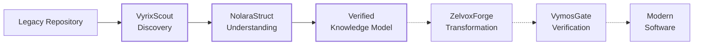

<div align="center">


<br />

# LegacyExodus

### Knowledge-First Software Modernization & Repository Intelligence

**Understand deterministically. Transform carefully. Verify everything.**

<br />

[](#current-status)
[](#engineering-evidence)
[](#technology)
[](#technology)
[](https://github.com/LegacyExodus/LegacyExodus/blob/main/LICENSE)

</div>

---

## What is LegacyExodus?

**LegacyExodus** is a deterministic software-analysis and modernization platform designed to understand complex legacy codebases **before attempting transformation**.

Instead of sending an entire repository directly to an LLM, LegacyExodus first reconstructs the software system through structured program analysis.

* **Discover** — map files, modules, dependencies, and repository boundaries.
* **Understand** — reconstruct ASTs, symbols, scopes, call graphs, CFGs, and DFGs.
* **Transform** — generate modernization proposals from verified system knowledge.
* **Verify** — validate generated software through deterministic engineering gates.

> [!IMPORTANT]
> LegacyExodus treats deterministic analysis as the source of truth.
> AI is planned as a bounded reasoning layer — not the authority over program behavior.

---

## Platform at a Glance

<table>
<tr>

<td width="25%" align="center">

### 🔎 VyrixScout

**Discovery**

Repository inventory
Dependency mapping
Boundary validation

🟢 **Implemented**

</td>

<td width="25%" align="center">

### 🧠 NolaraStruct

**Understanding**

AST & symbols
CFG / DFG analysis
Semantic relationships

🟢 **Implemented**

</td>

<td width="25%" align="center">

### ⚡ ZelvoxForge

**Transformation**

Architecture planning
AI-assisted synthesis
Modern Rust targets

🟣 **Planned**

</td>

<td width="25%" align="center">

### 🛡️ VymosGate

**Verification**

Compiler validation
Security gates
Human approval

🟣 **Planned**

</td>

</tr>
</table>

---

## How It Works



**Solid path = implemented today**
**Dashed path = target modernization architecture**

---

## Current Status

<table>
<tr>
<td width="25%" align="center">

### 1,001

**Passing Tests**

</td>
<td width="25%" align="center">

### 113

**Test Files**

</td>
<td width="25%" align="center">

### 10 / 10

**Governance Audits**

</td>
<td width="25%" align="center">

### 3 Runs

**Deterministic Validation**

</td>
</tr>
</table>

### ✅ Implemented

* Deterministic JavaScript / TypeScript repository analysis
* Babel AST parsing and normalization
* Scope, symbol, destructuring, and hoisting analysis
* Module resolution and dependency graphs
* Semantic call-graph reconstruction
* Control-flow and data-flow analysis
* Interprocedural taint-flow foundations
* In-memory and SQLite storage providers
* Streaming JSON serialization with bounded backpressure
* Snapshot restoration and deterministic artifact reuse
* Three-Universe fidelity validation
* CLI analysis, testing, verification, and JSON output
* Security and lifecycle hardening

### 🔭 Target Architecture

* Unified IR / SSA representation
* Governed AI Gateway
* Multi-agent modernization workflows
* Rust / Axum / SQLx generation
* Isolated compiler sandboxes
* Automated repair loops
* Human-in-the-loop migration approval

---

## Engineering Evidence

LegacyExodus does not treat passing tests as proof of complete migration correctness.

| Validation              |                    Result |
| ----------------------- | ------------------------: |
| Full test suite         | **1,001 / 1,001 passing** |
| TypeScript checking     |              **0 errors** |
| Governance audit        |        **10 / 10 passed** |
| Repository verification |    **4 / 4 gates passed** |
| Fastify sample recall   |                **100.0%** |
| Express sample recall   |                 **99.4%** |
| Migration safety        |   **Not yet established** |

> [!WARNING]
> High sample recall demonstrates reconstruction quality inside validated samples.
> It does **not** prove whole-repository migration correctness.

---

## Engineering Principles

<table>
<tr>

<td width="33%">

### ⚙️ Deterministic First

Program analysis must be reproducible, explainable, and traceable to source evidence.

</td>

<td width="33%">

### 🧠 Bounded Intelligence

AI may reason over verified context, but must never invent the underlying system model.

</td>

<td width="33%">

### 🔐 Verify Everything

Transformations require testing, provenance, security controls, and explicit approval.

</td>

</tr>
</table>

---

## Technology

```text
Analysis        TypeScript · Babel · AST · CFG · DFG · Graph Algorithms
Runtime         Bun · SQLite · In-Memory Storage
Validation      Zod · Determinism Checks · Fidelity Models
Interface       CLI · Structured JSON · Local-First Tooling
Future Target   Rust · Axum · SQLx · Governed AI Automation
```

---

## Core Philosophy

> **Understand deterministically first.**
> **Transform probabilistically second.**
> **Verify continuously.**

LegacyExodus is built around a simple idea:

**software modernization should begin with evidence — not generation.**

---

## Explore LegacyExodus

| Resource                                                                                                          | Purpose                                    |
| ----------------------------------------------------------------------------------------------------------------- | ------------------------------------------ |
| **[LegacyExodus](https://github.com/LegacyExodus/LegacyExodus)**                                                  | Core analysis and modernization engine     |
| **[Roadmap](https://github.com/LegacyExodus/LegacyExodus/blob/main/ROADMAP.md)**                                  | Current milestones and future architecture |
| **[Architecture](https://github.com/LegacyExodus/LegacyExodus/tree/main/docs/architecture)**                      | Technical design and system boundaries     |
| **[Governance](https://github.com/LegacyExodus/LegacyExodus/blob/main/GOVERNANCE.md)**                            | Engineering and validation guarantees      |
| **[Contributing](https://github.com/LegacyExodus/LegacyExodus/blob/main/docs/development/contribution-guide.md)** | Contributor workflow and quality gates     |

---

<div align="center">

### Understand → Model → Verify → Modernize

**Building deterministic infrastructure for the next generation of software modernization.**

<br />

<sub>LegacyExodus · Open Source · MIT Licensed</sub>

</div>
